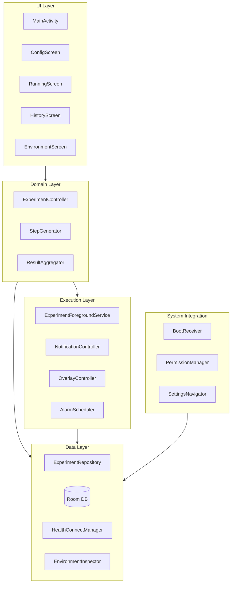

# AutoFit

**Android Background Execution Lab** — A repeatable, measurable research platform that uses Health Connect step writes as a controllable workload to study Android background execution behavior.

**Android 背景執行實驗平台** — 以 Health Connect 步數寫入作為可控工作負載，研究 Android 背景執行行為的可重複實驗平台。

[](https://developer.android.com/about/versions/12)
[](https://kotlinlang.org/)
[](LICENSE)
[](docs/SRS.md)
[](docs/)

**Repository:** [github.com/Pixson-Lin/AutoFit](https://github.com/Pixson-Lin/AutoFit)

---

## Table of Contents · 目錄

- [Overview](#overview)
- [Research Goals](#research-goals)
- [Features](#features)
- [Project Status](#project-status)
- [Architecture](#architecture)
- [Tech Stack](#tech-stack)
- [Documentation](#documentation)
- [Roadmap](#roadmap)
- [Test Scenarios](#test-scenarios)
- [Requirements](#requirements)
- [Getting Started](#getting-started)
- [Project Structure](#project-structure)
- [Design Principles](#design-principles)
- [Disclaimer](#disclaimer)
- [License](#license)

---

## Overview

AutoFit is a **repeatable, measurable, and comparable** Android experimentation platform. It runs a **Foreground Service** that periodically generates random step counts and writes them to **Health Connect**, while logging heartbeats, system state, and experiment results to analyze:

AutoFit 是一套**可重複執行、可量測、可比較**的 Android 實驗平台，透過 **Foreground Service** 產生隨機步數並寫入 **Health Connect**，同時記錄 Heartbeat 與系統狀態，用於分析：

- Behavioral differences across **Android versions** (12 / 15 / 16)  
  不同 **Android 版本**（12 / 15 / 16）的行為差異
- Impact of **Doze Mode**, battery saver, and battery optimization  
  **Doze Mode**、省電模式、電池最佳化的影響
- **OEM customization** (e.g. Samsung) on process survival  
  **OEM 客製化**（如 Samsung）對 Process 存活的影響
- **Foreground Service** survival when the screen is off or the app is swiped away  
  螢幕關閉、App 被滑掉等情境下的 **Foreground Service** 存活能力

> **Note · 注意**  
> This project studies the **Android background execution model**, not health data management. Steps written to Health Connect are **synthetic test data**.  
> 本專案研究目標是 **Android 背景執行模型**，並非健康 App。寫入 Health Connect 的步數為 **合成測試資料**。

---

## Research Goals

| ID | Question (EN) | 研究問題（中文） |
|----|---------------|------------------|
| Q1 | Can a Foreground Service survive reliably? | Foreground Service 是否能穩定存活？ |
| Q2 | Do different Android versions behave differently? | 不同 Android 版本是否有行為差異？ |
| Q3 | Does Samsung battery optimization affect execution? | Samsung 電池最佳化是否影響執行？ |
| Q4 | Does Doze Mode cause execution interruptions? | Doze Mode 是否造成執行中斷？ |
| Q5 | Are Health Connect writes stable? | Health Connect 寫入是否穩定？ |

---

## Features

| Category | Description (EN) | 說明（中文） |
|----------|------------------|--------------|
| **Experiment config** | Target cadence (SPM), random range, duration | 基準步頻、隨機範圍、執行時間 |
| **Background execution** | Long-running FGS, notification updates, optional overlay | FGS 長時間運行、通知更新、可選 Overlay |
| **Health Connect** | Batched `StepsRecord` writes with success/failure tracking | 批次寫入步數，記錄成功/失敗 |
| **Observability** | Per-minute heartbeat, env snapshots, results & history | 每分鐘 Heartbeat、環境快照、歷史紀錄 |
| **Environment check** | Battery optimization, power saver, permissions + settings shortcuts | 環境檢查與設定快速入口 |
| **Compatibility** | Android 12+ (API 31+), validated up to API 34/35 | 支援 Android 12+，驗證至 API 34/35 |

### Example Experiment · 實驗範例

```text
120 SPM
±15 Random
60 Minutes
```

---

## Project Status

| Phase | Status |
|-------|--------|
| Requirements (SRS) | Done |
| System design (SDS) | Done |
| Development plan (7 Sprints) | Done |
| Sprint 1 — Foundation | Done |
| Sprint 2 — Health Connect & Environment | Done |
| Sprint 3 — Foreground Service core loop | Done |
| Sprint 4 — HC batch write, notification, alarm | Done |
| Sprint 5 — Config / Running UI (MVP) | Done |
| Sprint 6 — History, Environment, auto-complete | Done |
| Sprint 7 — Overlay, Boot recovery, QA | Done |

Sprint 7 adds optional **`OverlayController`** (throttled status chip, graceful degrade without `SYSTEM_ALERT_WINDOW`), **`BootReceiver`** + **`BootInterruptionHandler`** (`INTERRUPTED_BY_REBOOT`), Environment overlay/HC install shortcuts, and **`docs/test_protocol.md`** for Test Cases A–D (`v0.7.0-sprint7`).

Sprint 7 已完成：**v1.0 研究平台** — Overlay、重開機中斷標記、相容性檢查清單與測試協議；可進行實機研究（Test Case A–D）。

---

## Architecture

**MVVM + Repository + Single Source of Truth** — five-layer design ([SDS](docs/SDS.md)).

採用 **MVVM + Repository + Single Source of Truth** 五層架構（詳見 [SDS](docs/SDS.md)）。



### Data Flow (simplified) · 資料流（簡化）

```text
User configures params → Start Foreground Service
    → Generate steps periodically → Batch write to Health Connect
    → Log Heartbeat / Write Event → Update notification
    → UI observes Room Flow (not service binding)
    → Stop or timeout → Aggregate ExperimentResult → Save to history
```

---

## Tech Stack

| Item | Choice |
|------|--------|
| Language · 語言 | Kotlin |
| UI | Jetpack Compose |
| Architecture · 架構 | MVVM + Repository Pattern |
| Local storage · 本地儲存 | Room (WAL) |
| Background · 背景執行 | Foreground Service + Coroutines |
| Health data · 健康資料 | Health Connect API (`StepsRecord`) |
| Min SDK · 最低版本 | Android 12 (API 31) |
| Target SDK · 目標版本 | API 35 |

**Out of scope for Phase 1 · Phase 1 不包含：** networking, cloud sync, data export (planned for Phase 2).  
網路連線、雲端同步、資料匯出（列為 Phase 2）。

---

## Documentation

| Document | Description (EN) | 說明（中文） |
|----------|------------------|--------------|
| [docs/SRS.md](docs/SRS.md) | Software Requirements Specification | 軟體需求規格 |
| [docs/SDS.md](docs/SDS.md) | Software Design Specification | 軟體設計規格 |
| [docs/dev_plan.md](docs/dev_plan.md) | 7-sprint dev plan, estimates, milestones | 7 Sprint 開發計畫與里程碑 |

---

## Roadmap

| Milestone | Sprint | Acceptance (EN) | 驗收（中文） |
|-----------|--------|-----------------|--------------|
| M0 | Sprint 1 | Project builds; Room + domain unit tests pass | 專案可編譯；Room + Domain 單測通過 |
| M1 | Sprint 3 | FGS runs without UI; continuous heartbeats | 無 UI 可啟動 FGS；Heartbeat 連續 |
| M2 | Sprint 4 | Full backend: steps → HC → notification | 完整 backend pipeline |
| **MVP** | Sprint 5 | UI start/stop experiment | UI 可啟動/停止實驗 |
| **Beta** | Sprint 6 | History, environment, auto-completion | History、Environment 完整 |
| **v1.0** | Sprint 7 | Overlay, boot handling, Test Cases A–D | Overlay、Boot、Test Case A–D |

<details>
<summary>Sprint overview (click to expand) · Sprint 一覽</summary>

| Sprint | Topic (EN) | 主題（中文） | Est. hours |
|--------|------------|--------------|------------|
| 1 | Project scaffold + Room + Domain | 專案骨架 + Room + Domain | 56–64 h |
| 2 | Environment + Health Connect | 環境檢測 + Health Connect | 64–72 h |
| 3 | Foreground Service core loop | FGS 核心迴圈 | 72–80 h |
| 4 | HC batch write + Notification + Alarm | HC 批次寫入 + 通知 + Alarm | 64–72 h |
| 5 | Config / Running UI | 設定 / 執行中 UI | 56–64 h |
| 6 | History + Environment + completion | 歷史 + 環境 + 完成流程 | 56–64 h |
| 7 | Overlay + Boot + compatibility + QA | Overlay + Boot + 相容性 + QA | 72–88 h |

</details>

---

## Test Scenarios

Standard scenarios from the SRS for cross-device comparison:

| Test Case | Condition (EN) | 條件（中文） | Observe |
|-----------|----------------|--------------|---------|
| **A** — Screen Off | 120 SPM, 60 min, screen off | 120 SPM, 60 分鐘, 螢幕關閉 | Service alive? Continuous heartbeats? |
| **B** — Battery Saver | 120 SPM, 60 min, saver on | 120 SPM, 60 分鐘, 省電模式 ON | Missed heartbeats? Service restart? |
| **C** — Task Removal | Swipe away from recents after start | Start 後滑掉 Recent Task | Service still running? |
| **D** — Reboot | Reboot during experiment | 實驗進行中重開機 | Lost? Status marked correctly? |

---

## Requirements

### Development · 開發環境

- Android Studio (latest stable recommended)
- JDK 17+
- Android SDK API 31–35
- Android Emulator (recommended: API 31 + API 34 AVDs)

### Runtime · 執行環境

- Android 12+ device or emulator
- Health Connect available:
  - **Android 12 / 13:** install [Health Connect APK](https://play.google.com/store/apps/details?id=com.google.android.apps.healthdata)
  - **Android 14+:** built into the platform

### Permissions (after implementation) · 必要權限

- `FOREGROUND_SERVICE` / `FOREGROUND_SERVICE_HEALTH`
- `POST_NOTIFICATIONS` (Android 13+)
- `WRITE_STEPS` (Health Connect)
- `SCHEDULE_EXACT_ALARM` (Doze backstop)
- `SYSTEM_ALERT_WINDOW` (overlay, optional)
- `REQUEST_IGNORE_BATTERY_OPTIMIZATIONS` (experiment variable)

---

## Getting Started

### Prerequisites · 前置需求

- Android Studio with SDK API 31–35
- JDK 17+ (Android Studio JBR works)

### Build · 建置

```bash
git clone https://github.com/Pixson-Lin/AutoFit.git
cd AutoFit

# Windows
gradlew.bat assembleDebug
gradlew.bat testDebugUnitTest

# macOS / Linux
./gradlew assembleDebug
./gradlew testDebugUnitTest

# Install on emulator or device
adb install -r app/build/outputs/apk/debug/app-debug.apk
```

### Usage flow (expected) · 預期使用流程

1. Open the app → **Environment** — verify permissions and system state  
   開啟 App → **Environment** 頁確認權限與系統狀態
2. **Config** — set SPM, random range, duration  
   **Config** 頁設定參數
3. Press **Start** to begin the experiment  
   按下 **Start** 啟動實驗
4. **Running** — watch live status, or background the app for testing  
   **Running** 頁觀察狀態，或切至背景測試
5. **History** — review results and success rate after completion  
   **History** 頁查看結果與成功率

---

## Project Structure

Current layout ([SDS §2.3](docs/SDS.md)):

```text
AutoFit/
├── app/
│   └── src/main/java/com/pixson/autofit/
│       ├── ui/                   # MainActivity, Compose theme (Sprint 1)
│       ├── domain/               # StepGenerator, ResultAggregator (Sprint 1)
│       ├── data/local/           # Room entities, DAOs, AppDatabase
│       ├── data/health/          # HealthConnectManager (Sprint 2)
│       ├── data/env/             # EnvironmentInspector (Sprint 2)
│       ├── data/repo/            # ExperimentRepository
│       ├── domain/               # ExperimentController (Sprint 2)
│       ├── service/              # ExperimentForegroundService, loop runner
│       └── system/               # PermissionManager, SettingsNavigator
├── docs/
│   ├── SRS.md
│   ├── SDS.md
│   └── dev_plan.md
├── gradlew.bat
├── LICENSE
└── README.md
```

---

## Design Principles

| Principle (EN) | 原則（中文） |
|----------------|--------------|
| **Single Source of Truth** — Room is authoritative; UI only observes `Flow` | Room 為唯一權威狀態；UI 僅觀察 `Flow` |
| **Resource efficiency first** — single coroutine loop, batched HC writes, throttled notifications | 單一 coroutine、批次寫入、節流通知 |
| **Fail-open observability** — failed writes or missed heartbeats are data, not crashes | 失敗與漏接是研究數據，不應 crash |
| **Local-only (Phase 1)** — no network; data stays in app sandbox | 無網路；資料留在 app sandbox |
| **Honest limits** — e.g. mark `INTERRUPTED_BY_REBOOT` instead of faking FGS recovery | 誠實記錄限制，不假裝恢復 |

---

## Disclaimer

- Steps written to Health Connect are **synthetic test data** — not for real health tracking or medical use.  
  寫入 Health Connect 的步數為**合成測試資料**，請勿用於真實健康或醫療用途。
- Intended for **research and education**; results vary by device, OEM, and Android version.  
  本工具用於**研究與教學**，結果因裝置與版本而異。
- OEM background policies (e.g. Samsung) cannot be fully reproduced on emulators — use physical devices for critical tests.  
  OEM 背景管理無法在 Emulator 完整重現，關鍵實驗建議使用實機。

---

## License

This project is licensed under the [MIT License](LICENSE).

Copyright (c) 2026 Pixson

本專案採用 [MIT 授權條款](LICENSE)。

---

<p align="center">
  <sub>
    <a href="https://github.com/Pixson-Lin/AutoFit">github.com/Pixson-Lin/AutoFit</a>
    · AutoFit · Android Background Execution Lab · 2026
  </sub>
</p>
