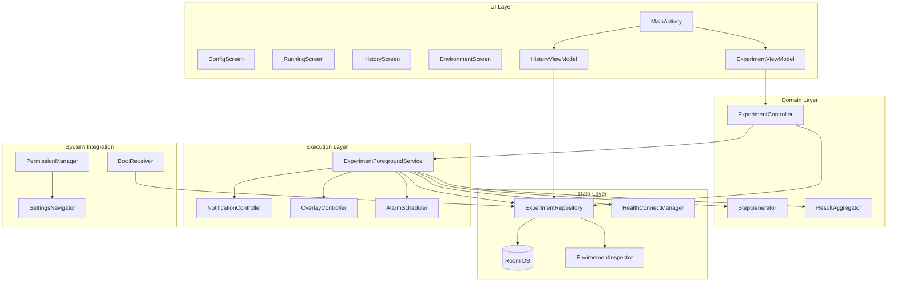
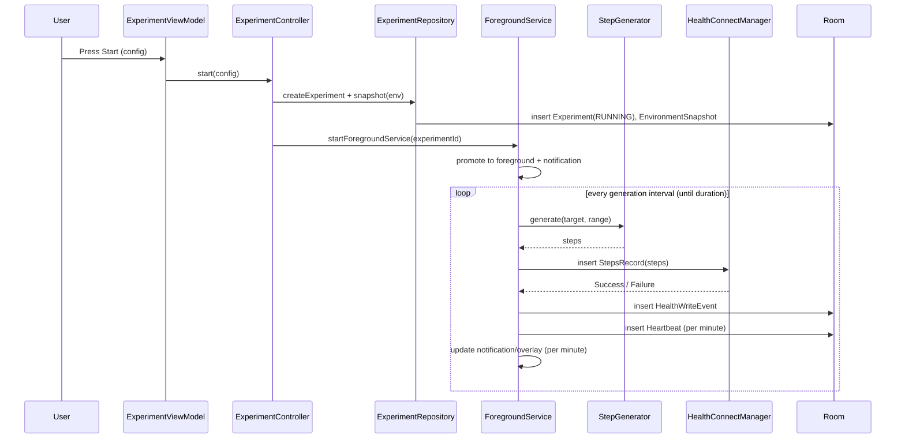
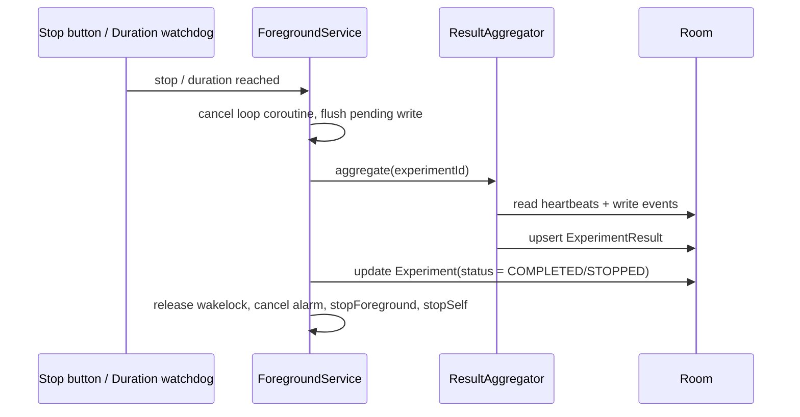
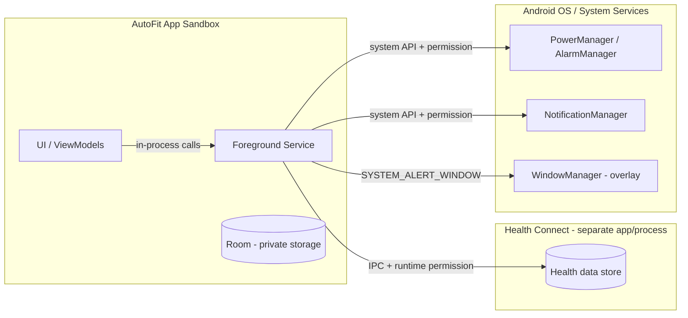

# AutoFit — Android Background Execution Lab
## Software Design Specification (SDS)
### Version 0.1 Draft

| 項目 | 內容 |
|------|------|
| Project Name | AutoFit (Android Background Execution Lab) |
| Document Type | Software Design Specification (SDS) |
| Companion Document | [docs/SRS.md](docs/SRS.md) |
| Version | 0.1 Draft |
| Author | Pixson |
| Date | 2026-06-06 |
| Status | Draft |
| Target Platform | Android 12+ (API 31+) |
| Language / UI | Kotlin + Jetpack Compose |

---

# 1. Document Information

## 1.1 Purpose

This document is the design counterpart to the SRS. It defines **how** the AutoFit system is built to satisfy the functional and non-functional requirements of [docs/SRS.md](docs/SRS.md).

AutoFit is an Android research platform that uses **Health Connect step writing as a controllable workload** to study Android background-execution behavior across Android versions and OEM (Samsung) customizations. The design therefore optimizes for two competing concerns simultaneously:

1. **Survivability** — the workload must keep running under screen-off, Doze, battery-saver, task-removal, and reboot.
2. **Resource efficiency** — the lab itself must not be the reason the OS kills the process, so CPU, wakelocks, I/O, and memory are minimized.

## 1.2 Design Principles

- **Single Source of Truth**: Room is the only authoritative state store; UI never holds long-lived mutable experiment state.
- **MVVM + Repository** (SRS NFR-005): clear separation of UI, domain, and data.
- **Local-only (Phase 1)**: no network; all data stays in the app sandbox. This removes an entire class of security/privacy surface.
- **Fail-open observability**: a failed Health Connect write or a missed heartbeat is *data*, not a crash. Errors are recorded and the experiment continues.
- **Resource efficiency first**: prefer one long-lived coroutine over many timers, batch writes, and throttle UI/notification updates.

## 1.3 SRS Traceability Overview

| SRS Item | Realized By (see section) |
|----------|---------------------------|
| FR-001 Create Experiment | `ConfigScreen` + `ExperimentViewModel` + `ExperimentRepository` (§3.1, §3.3) |
| FR-002 Start Experiment | `ExperimentController` -> `ExperimentForegroundService` (§3.4, §4.2) |
| FR-003 Generate Step Data | `StepGenerator` inside service loop (§3.4, §4.2) |
| FR-004 Write Health Connect | `HealthConnectManager` (§3.3) |
| FR-005 Heartbeat Logging | Service loop + `HeartbeatDao` (§3.4, §4.2) |
| FR-006 Notification Update | `NotificationController` (§3.4) |
| FR-007 Stop Experiment | `ExperimentController.stop()` (§4.3) |
| FR-008 Experiment Completion | Service duration watchdog (§4.3) |
| FR-009 View History | `HistoryScreen` + reactive `Flow` (§3.1, §4.4) |
| FR-010 Environment Assessment | `EnvironmentInspector` (§3.3) |
| FR-012 Settings Navigation | `SettingsNavigator` (§3.5) |
| NFR-001 Reliability | Foreground Service + recovery (§4, §6) |
| NFR-002 Repeatability | Immutable experiment config persisted (§3.2) |
| NFR-003 Observability | Event logging across all layers (§4, §7) |
| NFR-004 Compatibility | Version matrix (§10) |
| NFR-005 Maintainability | Layered MVVM (§2) |
| Q1–Q5 / Test Cases A–D | Failure analysis (§6) |

---

# 2. Architecture Overview

## 2.1 Layered Architecture

AutoFit uses a 5-layer architecture. Dependencies point **downward only**; the UI never touches Health Connect or Room directly.



## 2.2 Layer Responsibilities

- **UI Layer**: stateless Compose screens driven by `StateFlow` from ViewModels. Renders config, live status, history, and environment readiness. Holds no business logic.
- **Domain Layer**: pure, testable Kotlin. `StepGenerator` computes step values; `ExperimentController` orchestrates start/stop; `ResultAggregator` computes `ExperimentResult`.
- **Data Layer**: `ExperimentRepository` is the single gateway to Room, Health Connect, and environment data. Exposes reactive `Flow`s upward.
- **Execution Layer**: the `ExperimentForegroundService` is the long-lived heart of the system — it owns the generation loop, notification, overlay, and Doze backstop alarm.
- **System Integration**: cross-cutting OS touchpoints — boot recovery, permission checks, and deep links to system settings.

## 2.3 Process & Module Model

- **Single process, single APK.** No multi-process services (a separate `:service` process would *double* memory pressure and worsen survivability — rejected for resource efficiency).
- Suggested Gradle module / package structure (single module, package-by-layer):

```text
com.pixson.autofit
├── ui            (Compose screens, ViewModels, theme)
├── domain        (StepGenerator, ExperimentController, ResultAggregator, models)
├── data
│   ├── local     (Room: entities, DAOs, AppDatabase)
│   ├── health    (HealthConnectManager)
│   ├── env       (EnvironmentInspector)
│   └── repo      (ExperimentRepository)
├── service       (ExperimentForegroundService, NotificationController, OverlayController, AlarmScheduler)
└── system        (BootReceiver, PermissionManager, SettingsNavigator)
```

---

# 3. Component Design (Task 1)

## 3.1 UI Components

- **`MainActivity`** — single-Activity host. Owns the Compose `NavHost` and requests runtime permissions. Survives configuration changes; never owns experiment state.
- **`ConfigScreen`** (FR-001) — inputs for `targetCadence` (SPM), `randomRange` (±), `durationMinutes`. Validates ranges before enabling Start.
- **`RunningScreen`** (FR-002/006) — live status: elapsed/remaining, total steps, last heartbeat, write success/failure counters. Bound to a `StateFlow` mirrored from the service via Room.
- **`HistoryScreen`** (FR-009) — list of past experiments with start/end time, duration, total steps, success rate; drill-down to per-experiment results.
- **`EnvironmentScreen`** (FR-010/012) — readiness checklist (battery optimization, power-save, charging, notification permission, Health Connect permission) with one-tap fixes via `SettingsNavigator`.
- **`ExperimentViewModel`** — exposes UI state, validates config, delegates start/stop to `ExperimentController`. Uses `viewModelScope`; holds no timers.
- **`HistoryViewModel`** — exposes `Flow<List<ExperimentResult>>` from the repository.

> Design note: live status is **not** pushed from the service via binding. The service writes heartbeats to Room; the UI observes Room. This keeps the service decoupled from UI lifecycle (UI can be destroyed/recreated freely) and is intrinsically crash-safe.

## 3.2 Domain Components

- **`StepGenerator`** (FR-003) — pure function:

```text
generatedSteps = targetCadence + randomOffset
randomOffset   ∈ [-randomRange, +randomRange]   (uniform, seedable)
```

  Seedable RNG enables NFR-002 repeatability (a fixed seed reproduces the same sequence). Output is clamped to be non-negative.
- **`ExperimentController`** — façade used by the UI. Responsibilities: create the `Experiment` row, capture the `EnvironmentSnapshot`, start/stop the foreground service via explicit `Intent`, and expose the active experiment id.
- **`ResultAggregator`** — given an experiment id, folds heartbeats and write events into an `ExperimentResult` (total steps, heartbeat count, write success/failure counts, actual duration).

## 3.3 Data Components

- **`AppDatabase` (Room, WAL mode)** — entities map 1:1 to SRS §6: `Experiment`, `Heartbeat`, `HealthWriteEvent`, `ExperimentResult`, `EnvironmentSnapshot`. `Instant`/`UUID` handled by type converters. Indices on `experimentId`.
- **DAOs** — `ExperimentDao`, `HeartbeatDao`, `HealthWriteEventDao`, `ResultDao`, `EnvironmentDao`. Writes are `suspend`; reads return `Flow`. Bulk inserts where applicable.
- **`ExperimentRepository`** — single source of truth gateway. Coordinates Room + Health Connect + environment. All callers (UI, service, boot receiver) go through it.
- **`HealthConnectManager`** (FR-004) — thin wrapper over `HealthConnectClient`. Responsibilities: availability check (`getSdkStatus`), permission check, and `insertRecords(StepsRecord)` with start/end timestamps. Returns a sealed result (`Success` / `Failure(reason)`) so the loop can log a `HealthWriteEvent` either way. Steps are **batched per write interval**, not per second.
- **`EnvironmentInspector`** (FR-010) — reads `PowerManager` (battery optimization ignore-list, power-save mode), `BatteryManager` (level, charging), `Build` (model/manufacturer/version), and permission states to produce an `EnvironmentSnapshot`.

## 3.4 Execution Components

- **`ExperimentForegroundService`** — the core. Started via `startForegroundService` with `foregroundServiceType` = `health` (+ `specialUse` where needed for overlay on A14+). Key behaviors:
  - Promotes to foreground within 5 s with a persistent notification (Android requirement).
  - Runs **one** generation coroutine on a dedicated dispatcher (see §4.2).
  - Returns `START_REDELIVER_INTENT` so the OS re-delivers the experiment parameters if the process is killed and restarted.
  - Owns a `PARTIAL_WAKE_LOCK` acquired only around each generation tick (not held continuously).
- **`NotificationController`** (FR-006) — builds/updates the ongoing notification (running status, total steps, remaining time, experiment id). Updates are **throttled to once per heartbeat (per minute)**, never per generation tick, to avoid notification-rate-limit throttling and wasted CPU.
- **`OverlayController`** — optional `TYPE_APPLICATION_OVERLAY` window ("Display over other apps", SRS §2 Scope). Shows a minimal always-on status chip. Redraws only when displayed values change.
- **`AlarmScheduler`** — schedules `AlarmManager.setExactAndAllowWhileIdle` as a **Doze-resilience backstop**: if the coroutine `delay()` is suspended in deep Doze, the alarm fires a watchdog that records a heartbeat and re-arms the loop. This is the difference between "missed heartbeat" being *measured* vs *invisible*.

## 3.5 System Integration Components

- **`BootReceiver`** (`RECEIVE_BOOT_COMPLETED`) — on reboot, queries Room for an experiment in `RUNNING` state. It marks the gap (records the reboot in the result) and, where the OS permits, attempts recovery. Documented limitation: see §6.5.
- **`PermissionManager`** — centralizes runtime permission state: `POST_NOTIFICATIONS` (A13+), Health Connect permissions, `SYSTEM_ALERT_WINDOW`, `SCHEDULE_EXACT_ALARM` (A12+), battery-optimization exemption.
- **`SettingsNavigator`** (FR-012) — fires the correct `Settings.*` intents: battery optimization, app details, notification settings, and the Health Connect management screen.

---

# 4. Data Flow (Task 2)

## 4.1 Coroutine & Threading Model

- **One** generation loop coroutine on a single-threaded `Dispatchers.Default`-derived dispatcher; sleeps via `delay()` between ticks.
- Room and Health Connect I/O run on `Dispatchers.IO` via `suspend` calls.
- UI observes Room `Flow`s on the main dispatcher.
- No `Timer`, no `Handler` thread per task, no thread pool — minimizing concurrency footprint is a core resource-efficiency decision.

## 4.2 Start → Generate → Write → Log → Update



The UI's `RunningScreen` is **not** in this loop — it independently observes the `Heartbeat`/`HealthWriteEvent` `Flow`s from Room and re-renders. This decoupling is what makes the service immune to UI lifecycle.

## 4.3 Stop / Completion → Aggregation



- **FR-007 (manual stop)** and **FR-008 (auto-complete)** share this path; only the terminal `status` differs.
- A `durationMinutes` watchdog inside the loop guarantees completion even if the UI is gone.

## 4.4 History Read Flow

`HistoryScreen` → `HistoryViewModel` → `ExperimentRepository.observeResults()` → `ResultDao` `Flow`. Pure reactive read; no service involvement.

---

# 5. Security & Privacy Boundaries (Task 3)

## 5.1 Trust Boundaries



## 5.2 Boundary Details

- **App sandbox boundary**: all AutoFit data (Room DB, experiment logs) lives in private app storage. No `WorldReadable`/external storage, no exported components except the explicitly-needed `BootReceiver` (guarded by `RECEIVE_BOOT_COMPLETED` and an action filter).
- **Health Connect boundary (privacy-sensitive)**: Health Connect is a **separate app/process** with its own permission model. AutoFit holds only `WRITE_STEPS` (and `READ_STEPS` if read-back verification is enabled). Permissions are granted per-type at runtime and revocable at any time. AutoFit must treat write rejection as normal (§6.4).
- **Notification permission** (`POST_NOTIFICATIONS`, A13+): required to display the foreground notification. If denied on A13+, the service may run but with degraded visibility — this is a measured condition, not a crash.
- **Overlay permission** (`SYSTEM_ALERT_WINDOW`): user-granted via a special settings screen, not a normal runtime grant. Treated as optional; the overlay degrades gracefully if absent.
- **Exact alarm** (`SCHEDULE_EXACT_ALARM` / `USE_EXACT_ALARM`, A12+): needed for the Doze backstop. On A12/A13 it can be revoked by the user/OS; AutoFit detects `canScheduleExactAlarms()` and falls back to inexact alarms.
- **Battery-optimization exemption** (`REQUEST_IGNORE_BATTERY_OPTIMIZATIONS`): requested via dialog, never silently. Whether it is granted is itself an experiment variable (Q3).

## 5.3 Data Sensitivity

- Step data written to Health Connect is synthetic but is still real health-store data — the user must be informed it is test data. No PII is collected or transmitted.
- Phase 1 has **no network permission** at all, eliminating exfiltration risk. Cloud sync (SRS §8) would reintroduce transport security and would be designed separately.

---

# 6. Failure Points & Mitigations (Task 4)

Each failure is mapped to the SRS research questions (Q1–Q5) and test cases (A–D) it relates to.

## 6.1 Process Death / OEM Kill (Q1, Q3 — Test Case C)
- **Cause**: low-memory kill, Samsung aggressive background management, task swipe-away.
- **Detection**: gap between consecutive heartbeat timestamps in Room; service `onDestroy`/`onTaskRemoved` logging.
- **Mitigation**: `START_REDELIVER_INTENT` re-delivers params; experiment state persisted in Room so a restarted service resumes from the last known tick. The *measured* gap is itself a primary research output.

## 6.2 Doze Mode (Q4 — Test Case A)
- **Cause**: deep Doze suspends `delay()` and defers wakeups.
- **Detection**: heartbeat interval drift > expected.
- **Mitigation**: `setExactAndAllowWhileIdle` backstop alarm (§3.4). Note the OS rate-limits idle exact alarms (~once / 9 min in deep Doze), which itself bounds achievable cadence — documented as an inherent limit.

## 6.3 Battery Saver / Power-Save (Q3 — Test Case B)
- **Cause**: background CPU/network throttling, alarm deferral.
- **Detection**: `EnvironmentInspector` records `powerSaveMode`; heartbeat gaps correlate.
- **Mitigation**: foreground service is the strongest legal exemption; results quantify residual impact.

## 6.4 Health Connect Unavailable / Permission Revoked (Q5)
- **Cause**: HC app not installed/updated, SDK status not `AVAILABLE`, runtime permission revoked mid-run.
- **Detection**: `getSdkStatus()` and per-write sealed `Failure`.
- **Mitigation**: each attempt logs a `HealthWriteEvent(success=false, errorMessage)`; the loop continues so the experiment timeline stays intact. UI surfaces a remediation hint via `SettingsNavigator`.

## 6.5 Device Reboot (Test Case D)
- **Cause**: reboot during experiment terminates the process.
- **Detection**: `BootReceiver` finds a `RUNNING` experiment with no recent heartbeat.
- **Mitigation / limitation**: AutoFit records the reboot boundary in the result. **Android 12+ does not allow apps to auto-start a foreground service from `BOOT_COMPLETED` without user-facing entry in the general case**, and a non-exempt app cannot reliably resume a long-running FGS post-boot. Honest design choice: the experiment is marked `INTERRUPTED_BY_REBOOT` rather than silently faking recovery; auto-resume is best-effort only when the app is battery-exempt.

## 6.6 Notification Denied (A13+)
- **Cause**: `POST_NOTIFICATIONS` denied.
- **Mitigation**: service still starts (foreground type satisfied) but flags reduced observability; `EnvironmentScreen` prompts the user to grant.

## 6.7 Time Drift / Clock Change
- **Cause**: NTP correction or manual clock change skews `Instant`-based intervals.
- **Mitigation**: use `SystemClock.elapsedRealtime()` for interval scheduling (monotonic) while storing wall-clock `Instant` for records — decouples scheduling from wall-clock changes.

---

# 7. Resource-Efficiency Strategy

Resource efficiency is a primary constraint, not an afterthought. Concrete tactics:

- **Single generation coroutine** with `delay()` instead of N timers/alarms — minimizes wakeups and thread count.
- **Batched Health Connect writes** — accumulate steps for an interval and write one `StepsRecord`, instead of one write per second (orders-of-magnitude fewer IPC round-trips and DB writes).
- **Throttled notification & overlay updates** — refreshed once per minute (per heartbeat), never per tick; avoids notification-rate throttling and redraw cost.
- **Scoped wakelock** — `PARTIAL_WAKE_LOCK` acquired only for the few milliseconds of each tick, released immediately; never held across `delay()`.
- **Room WAL + bulk inserts + indices** — reduces fsync pressure and keeps reactive reads cheap.
- **Monotonic scheduling** (`elapsedRealtime`) — avoids redundant recomputation from clock corrections.
- **No background network / no polling** in Phase 1.
- **Compose with `StateFlow` + stable keys** — recomposition limited to changed values.

---

# 8. Tradeoffs (Task 5)

- **Foreground Service loop vs WorkManager** — *Chosen: FGS loop.* WorkManager's minimum periodic interval is 15 min and is Doze-throttled, making per-minute cadence (FR-003/005) impossible; it also hides the very background-throttling behavior this lab studies. The FGS loop gives precise, observable control at the cost of being more "visible" to OEM killers — which is itself the phenomenon under study.
- **Exact vs inexact alarms** — *Chosen: exact (with inexact fallback).* Exact alarms give measurable Doze behavior but require `SCHEDULE_EXACT_ALARM` and consume slightly more power; fallback preserves function when the permission is unavailable.
- **Per-write vs batched Health Connect writes** — *Chosen: batched.* Far cheaper (CPU/IPC/battery); slightly coarser temporal granularity in the health store. Acceptable because the research signal is survivability, not per-second fidelity.
- **Jetpack Compose vs XML Views** — *Chosen: Compose.* Faster development, less boilerplate, good recomposition control. Slightly larger baseline APK/method count vs XML; negligible for this single-screen-set app. (Java/XML remains a valid alternative per the SRS constraint.)
- **`START_REDELIVER_INTENT` vs `START_STICKY`** — *Chosen: REDELIVER.* Guarantees the original experiment parameters are re-delivered on restart (STICKY delivers a null intent), which matters for resume correctness.
- **Continuous vs scoped wakelock** — *Chosen: scoped.* A continuous wakelock would maximize survivability but drains battery and risks the OS flagging the app; scoped wakelock balances survivability with the resource-efficiency constraint.
- **UI-observes-Room vs Service-binding** — *Chosen: observe Room.* Slight write amplification (heartbeats persisted even when UI is closed) in exchange for full decoupling and crash-safety. The persisted data is required anyway (NFR-003).

---

# 9. Known Issues & Risks (Task 6)

- **OEM aggressive process killing (Samsung)** — Samsung's background management may kill even foreground services under certain conditions; battery-optimization exemption helps but is not guaranteed. This is both a risk and a primary study target (Q3).
- **Health Connect availability variance** — On Android 12/13, Health Connect is a **separately-installed APK** (`getSdkStatus` may be `NOT_INSTALLED`/`UPDATE_REQUIRED`); on Android 14+ it is **built into the platform**. The app must handle all states and guide installation. This is the single biggest compatibility risk for FR-004.
- **Exact-alarm permission friction** — `SCHEDULE_EXACT_ALARM` is restricted on A12+ and may be auto-revoked; the Doze backstop degrades to inexact, reducing measurement precision.
- **Overlay UX friction** — `SYSTEM_ALERT_WINDOW` requires a manual settings toggle and is increasingly discouraged; some OEMs add extra friction. Overlay is therefore optional.
- **Reboot auto-resume limits** — as in §6.5, true post-reboot auto-resume is not reliably achievable without exemptions; the design measures rather than masks this.
- **Foreground service type enforcement (A14+)** — A14 requires a declared `foregroundServiceType` matching actual use and may require justification for `specialUse`; mis-declaration causes `startForeground` to throw. Must be validated per release.
- **Notification rate limiting** — over-frequent notification updates can be throttled by the system; mitigated by the per-minute throttle but worth monitoring.

---

# 10. Android Version Compatibility Matrix (NFR-004)

| Concern | Android 12 (31/32) | Android 13 (33) | Android 14 (34) | Android 15 (35) | Android 16 (36) |
|---------|--------------------|-----------------|-----------------|-----------------|-----------------|
| Health Connect | Separate APK | Separate APK | Built-in platform | Built-in | Built-in |
| `POST_NOTIFICATIONS` | Not required | Required | Required | Required | Required |
| `foregroundServiceType` | Recommended | Recommended | **Enforced** | Enforced (stricter) | Enforced |
| `SCHEDULE_EXACT_ALARM` | Restricted (revocable) | Restricted | Restricted | Restricted | Restricted |
| Doze backstop alarm | Supported | Supported | Supported | Supported | Supported |
| Overlay (`SYSTEM_ALERT_WINDOW`) | Manual grant | Manual grant | Manual grant | Manual grant | Manual grant |

Design implication: a runtime capability-detection layer (`PermissionManager` + `HealthConnectManager.getSdkStatus()` + `AlarmScheduler.canScheduleExact()`) gates every version-sensitive path so the same APK runs across 12–16.

---

# 11. Manifest & Permissions Summary

Declared permissions (rationale in parentheses):

```text
android.permission.FOREGROUND_SERVICE                  (long-running workload)
android.permission.FOREGROUND_SERVICE_HEALTH           (A14+ typed FGS for HC workload)
android.permission.POST_NOTIFICATIONS                  (A13+ FGS notification)
android.permission.RECEIVE_BOOT_COMPLETED              (reboot detection/recovery)
android.permission.SCHEDULE_EXACT_ALARM / USE_EXACT_ALARM (Doze backstop)
android.permission.SYSTEM_ALERT_WINDOW                 (optional overlay)
android.permission.REQUEST_IGNORE_BATTERY_OPTIMIZATIONS (exemption request)
android.permission.WAKE_LOCK                           (scoped per-tick wakelock)
android.health.connect.permission.WRITE_STEPS          (HC step write)
android.health.connect.permission.READ_STEPS           (optional read-back verify)
```

Manifest highlights:

- `ExperimentForegroundService` declared with `android:foregroundServiceType="health"` (plus `specialUse` only if overlay-driven need is justified for A14+).
- `BootReceiver` exported with an explicit `BOOT_COMPLETED` intent filter and no other entry points.
- No `INTERNET` permission in Phase 1.

---

# 12. Open Items / Future Work

- Cloud sync, multi-device dashboard, CSV/JSON export, and Grafana/InfluxDB integration (SRS §8) are explicitly **out of scope for Phase 1** and would each require their own design addendum (notably network security for sync/export).
- Optional Health Connect read-back verification to cross-check that written steps actually landed (strengthens Q5 evidence).
