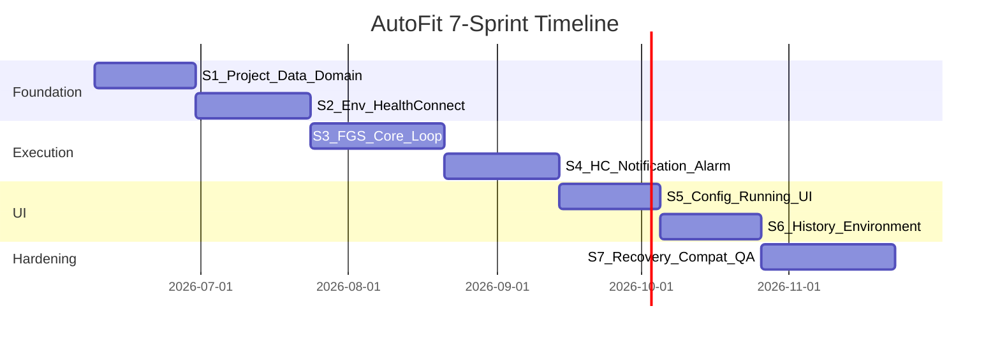
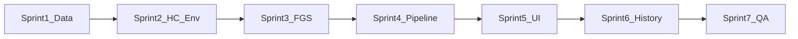

# AutoFit — 開發計畫（Development Plan）
### 7 Sprints · Phase 1

| 項目 | 內容 |
|------|------|
| Project Name | AutoFit (Android Background Execution Lab) |
| Document Type | Development Plan |
| Companion Documents | [SRS.md](SRS.md) · [SDS.md](SDS.md) |
| Version | 0.1 Draft |
| Author | Pixson |
| Date | 2026-06-06 |
| Status | Draft |

---

# 1. 文件資訊與規劃假設

## 1.1 目的

本文件將 [SRS.md](SRS.md) 與 [SDS.md](SDS.md) 中的需求，拆分為 **7 個可交付的 Sprint**，供 1 位兼職 Android 工程師依序實作。每個 Sprint 明確包含：

- **Coding** — 功能實作
- **Unit Testing** — JUnit5、Room in-memory、coroutine `TestDispatcher`、ViewModel 測試
- **Simulator Testing** — Android Emulator 手動/儀器化驗證（Sprint 3 起逐步加入；Sprint 5 起為常規項目）

## 1.2 規劃假設

| 假設項目 | 說明 |
|----------|------|
| 人力 | 1 位 Android 工程師，兼職 |
| 每週投入 | 約 15–20 小時 |
| Sprint 日曆週期 | 每 Sprint 約 **3–4 週** |
| 總工時 | 約 **460–560 人時** |
| 總日曆時間 | 約 **24–28 週**（不含 Sprint 7 後 Samsung 實機緩衝） |
| 技術棧 | Kotlin、Jetpack Compose、Room、Health Connect、Foreground Service |
| 目標平台 | Android 12+（API 31+），相容性驗證至 API 34/35 |
| 架構 | MVVM + Repository + Single Source of Truth（SDS §2） |

## 1.3 範圍外（Phase 2）

依 SRS §8，以下項目不納入本計畫：

- 雲端同步（Firebase / Google Drive）
- 多裝置 Dashboard
- CSV / JSON 匯出
- Grafana / InfluxDB 整合

## 1.4 工時分配慣例

每個 Sprint 工時拆分為三類（佔比因 Sprint 而異）：

- **Coding**：約 55–65%
- **Unit Testing**：約 25–30%
- **Simulator Testing**：約 10–20%（Sprint 1 僅 smoke；Sprint 7 最高）

---

# 2. Sprint 總覽

## 2.1 時程圖



## 2.2 總覽表

| Sprint | 主題 | 工時（h） | 日曆 | Simulator | 累計日曆 |
|--------|------|-----------|------|-----------|----------|
| 1 | 專案骨架 + Room + Domain | 56–64 | 3 週 | Build smoke only | 3 週 |
| 2 | Environment + Health Connect 基礎 | 64–72 | 3–4 週 | HC SDK 狀態檢查 | 6–7 週 |
| 3 | Foreground Service 核心迴圈 | 72–80 | 4 週 | adb 啟動、heartbeat 驗證 | 10–11 週 |
| 4 | HC 寫入 + Notification + Alarm | 64–72 | 3–4 週 | 通知列、write event | 13–15 週 |
| 5 | Config / Running UI | 56–64 | 3 週 | UC-001 端到端 | 16–18 週 |
| 6 | History + Environment + 完成流程 | 56–64 | 3 週 | FR-008/009/010/012 | 19–21 週 |
| 7 | Overlay + Boot + 相容性 + QA | 72–88 | 4 週 | Test Case A–D | 23–25 週 |
| **合計** | | **460–560** | **24–28 週** | | |

## 2.3 依賴關係



Sprint 之間為**嚴格順序依賴**：後續 Sprint 不可跳過前置交付物。

---

# 3. 里程碑

| 里程碑 | 完成時點 | 驗收標準 |
|--------|----------|----------|
| **M0** | Sprint 1 末 | 專案可編譯；Room + Domain 單元測試通過 |
| **M1** | Sprint 3 末 | 無 UI 可透過 adb 啟動 FGS；heartbeat 連續寫入 Room |
| **M2** | Sprint 4 末 | 完整 backend pipeline：產步數 → HC 寫入 → 通知更新 |
| **MVP** | Sprint 5 末 | 使用者可從 UI 設定參數、啟動/停止實驗（UC-001） |
| **Beta** | Sprint 6 末 | History、Environment、自動完成齊全 |
| **v1.0** | Sprint 7 末 | Overlay、Boot 處理、Test Case A–D 測試協議就緒 |

---

# 4. Sprint 詳細說明

---

## Sprint 1 — 專案骨架、資料層與 Domain

| 項目 | 內容 |
|------|------|
| 週期 | 3 週 |
| 工時 | **56–64 h**（Coding 34–38 · Unit Test 16–20 · Simulator 2–4） |
| 目標 | 可編譯的 Android 專案 + Room SSOT + 可單測的純 Kotlin domain |

### 4.1.1 Coding（34–38 h）

- [ ] Gradle 專案初始化
  - `minSdk 31`、`targetSdk 35`
  - Kotlin、Jetpack Compose BOM、Room、Coroutines、Navigation Compose
  - 測試依賴：JUnit5、MockK、Room testing、coroutines-test
- [ ] 套件結構（SDS §2.3）
  - `com.pixson.autofit.ui`
  - `com.pixson.autofit.domain`
  - `com.pixson.autofit.data.local / health / env / repo`
  - `com.pixson.autofit.service`
  - `com.pixson.autofit.system`
- [ ] Room 實體（SRS §6）
  - `Experiment`（id, startTime, durationMinutes, targetCadence, randomRange, status）
  - `Heartbeat`（id, experimentId, timestamp, generatedSteps, batteryLevel, screenOn, charging）
  - `HealthWriteEvent`（id, experimentId, timestamp, stepCount, success, errorMessage）
  - `ExperimentResult`（experimentId, totalSteps, heartbeatCount, writeSuccessCount, writeFailureCount, actualDuration）
  - `EnvironmentSnapshot`（experimentId, deviceModel, manufacturer, androidVersion, batteryOptimization, powerSaveMode, charging, batteryLevel, notificationPermission, healthConnectPermission）
- [ ] Type converters：`UUID`、`Instant`；`AppDatabase` 啟用 WAL
- [ ] DAOs：`ExperimentDao`、`HeartbeatDao`、`HealthWriteEventDao`、`ResultDao`、`EnvironmentDao`
- [ ] `ExperimentRepository`：基本 CRUD、`Flow` 查詢骨架
- [ ] `StepGenerator`（FR-003）：`targetCadence + randomOffset`，seedable RNG，非負 clamp
- [ ] `ResultAggregator` 骨架：從 heartbeat / write event 聚合結果

### 4.1.2 Unit Testing（16–20 h）

- [ ] `StepGeneratorTest`
  - 邊界值：`randomRange = 0`、大範圍偏移
  - Seed 可重現（NFR-002）：相同 seed → 相同序列
  - 輸出永遠 ≥ 0
- [ ] Room DAO tests（in-memory `AppDatabase`）
  - Insert / query / `Flow` emission
  - `experimentId` 索引查詢效能冒煙
- [ ] `ResultAggregatorTest`
  - 空 heartbeat / 空 write event
  - 部分資料聚合正確性

### 4.1.3 Simulator Testing（2–4 h）

- [ ] `./gradlew assembleDebug` 成功
- [ ] 安裝至 Emulator（API 31 或 34）— build smoke only
- [ ] 尚無功能 UI；確認 app 可啟動空白畫面

### 4.1.4 交付物

- 可編譯 Android 專案骨架
- Room schema + Repository 介面
- Domain 純函式 + 單元測試套件（CI 可跑）

### 4.1.5 SRS / SDS 對應

- NFR-005（架構骨架）
- NFR-002（StepGenerator seed）
- SRS §6 資料模型

### 4.1.6 風險

- Room migration 策略需從 Sprint 1 定好（避免後期 schema 變更成本）

---

## Sprint 2 — 環境檢測與 Health Connect 整合

| 項目 | 內容 |
|------|------|
| 週期 | 3–4 週 |
| 工時 | **64–72 h**（Coding 36–42 · Unit Test 18–22 · Simulator 6–8） |
| 目標 | Health Connect 可單次寫入；環境快照可擷取；權限與設定導航就緒 |

### 4.2.1 Coding（36–42 h）

- [ ] `HealthConnectManager`（FR-004）
  - `HealthConnectClient.getSdkStatus()`
  - 權限檢查（`WRITE_STEPS`）
  - `insertRecords(StepsRecord)` with start/end timestamps
  - Sealed result：`WriteResult.Success` / `WriteResult.Failure(reason)`
- [ ] `EnvironmentInspector`（FR-010）
  - `PowerManager`：battery optimization ignore-list、power-save mode
  - `BatteryManager`：level、charging state
  - `Build`：model、manufacturer、android version
  - 權限狀態 → `EnvironmentSnapshot`
- [ ] `PermissionManager`
  - `POST_NOTIFICATIONS`（A13+）
  - Health Connect runtime permissions
  - `SCHEDULE_EXACT_ALARM` / `USE_EXACT_ALARM`
  - `SYSTEM_ALERT_WINDOW`
  - `REQUEST_IGNORE_BATTERY_OPTIMIZATIONS`
- [ ] `SettingsNavigator`（FR-012）
  - Battery optimization settings
  - Application details settings
  - Notification settings
  - Health Connect management screen
- [ ] `ExperimentController`
  - `createExperiment(config)` → Room insert `RUNNING` + `EnvironmentSnapshot`
  - 尚不啟動 Foreground Service
- [ ] `AndroidManifest.xml` 權限宣告（SDS §11）

### 4.2.2 Unit Testing（18–22 h）

- [ ] `HealthConnectManagerTest`（mock `HealthConnectClient`）
  - SDK `NOT_INSTALLED` / `UPDATE_REQUIRED` / `AVAILABLE`
  - Permission denied → `Failure`
  - Success path → `Success`
- [ ] `EnvironmentInspectorTest`（mock system services）
  - 各欄位正確映射
- [ ] `PermissionManagerTest`
  - 權限組合狀態矩陣（granted / denied / not applicable）
- [ ] `ExperimentControllerTest`
  - 建立 experiment 後 Room 有 `RUNNING` 狀態 + snapshot

### 4.2.3 Simulator Testing（6–8 h）

- [ ] Emulator（API 31 或 33）安裝 Health Connect APK
- [ ] 驗證 `getSdkStatus()` 回傳預期狀態
- [ ] 權限請求流程（首次授予 `WRITE_STEPS`）
- [ ] Debug 入口或 instrumented test：單次 `StepsRecord` 寫入成功
- [ ] `SettingsNavigator` 各 intent 可正確跳轉（手動確認）

### 4.2.4 交付物

- Health Connect 單次寫入可用
- 環境快照 + 權限管理模組
- 設定快速入口

### 4.2.5 SRS / SDS 對應

- FR-004（單次寫入）
- FR-010、FR-012
- NFR-004（HC 可用性偵測）

### 4.2.6 風險與緩衝

- **HC Emulator 設定常耗時**，預留 **4–8 h** 緩衝
- A14+ 模擬器 HC 內建，與 A12/13 安裝 APK 路徑不同，需分開驗證

---

## Sprint 3 — Foreground Service 核心執行迴圈

| 項目 | 內容 |
|------|------|
| 週期 | 4 週 |
| 工時 | **72–80 h**（Coding 40–44 · Unit Test 20–24 · Simulator 8–12） |
| 目標 | 無 UI 可啟動實驗；每分鐘 heartbeat 寫入 Room；符合資源效率設計 |

### 4.3.1 Coding（40–44 h）

- [ ] `ExperimentForegroundService`（FR-002）
  - `startForegroundService` + `startForeground`（5 秒內）
  - `foregroundServiceType="health"`（A14+，`FOREGROUND_SERVICE_HEALTH`）
  - `START_REDELIVER_INTENT`
- [ ] 單一 coroutine generation loop（SDS §4.1）
  - `delay()` 控制 tick 間隔
  - `SystemClock.elapsedRealtime()` 排程（SDS §6.7）
  - Wall-clock `Instant` 用於記錄
- [ ] `StepGenerator` 整合（FR-003）
- [ ] 每分鐘 `Heartbeat` 寫入 Room（FR-005）
  - battery level、screen on/off、charging state
- [ ] Scoped `PARTIAL_WAKE_LOCK`
  - 每 tick 短暫 acquire / release；不跨 `delay()` 持有
- [ ] Experiment state 從 Room 恢復（process restart）
- [ ] Duration watchdog 骨架（FR-008 前置）
- [ ] `onDestroy` / `onTaskRemoved` 事件記錄（NFR-003）
- [ ] 基礎通知 channel 建立（完整內容留 Sprint 4）

### 4.3.2 Unit Testing（20–24 h）

- [ ] Service loop tests（`TestScope` + fake `ExperimentRepository`）
  - 3 min 短實驗 → 預期 heartbeat 筆數
  - Tick 間隔符合設定
- [ ] 恢復邏輯 test
  - 模擬 `START_REDELIVER_INTENT` 後從 Room 讀取 experiment
- [ ] Wakelock test（mock `PowerManager`）
  - acquire / release 成對、無洩漏

### 4.3.3 Simulator Testing（8–12 h）

- [ ] 透過 adb 啟動 service（短 duration 3 min）：

```bash
adb shell am start-foreground-service \
  -n com.pixson.autofit/.service.ExperimentForegroundService \
  --es experiment_id "<uuid>"
```

- [ ] 確認 foreground notification 出現
- [ ] 查驗 Room heartbeat 連續（logcat 或 debug DB inspector）
- [ ] **UC-002 初步**：螢幕關閉 + app 進入背景，heartbeat 仍寫入
- [ ] **UC-003 初步**：Recent task swipe，觀察 service 是否存活

### 4.3.4 交付物

- 可獨立運行的 Foreground Service
- Heartbeat 持續寫入 Room
- Process restart 恢復骨架

### 4.3.5 SRS / SDS 對應

- FR-002、FR-003、FR-005
- NFR-001（基礎可靠性）
- NFR-003（Service start/stop 事件）
- Q1 可觀測（heartbeat 連續性）

### 4.3.6 風險

- A14+ `foregroundServiceType` 宣告錯誤會導致 `startForeground` crash
- FGS 在 emulator 與實機行為可能不同，Sprint 7 需補強

---

## Sprint 4 — Health Connect 批次寫入、Notification、Doze Backstop

| 項目 | 內容 |
|------|------|
| 週期 | 3–4 週 |
| 工時 | **64–72 h**（Coding 34–38 · Unit Test 18–22 · Simulator 10–14） |
| 目標 | 完整 workload pipeline：產步數 → 批次寫 HC → 記錄 event → 更新通知 |

### 4.4.1 Coding（34–38 h）

- [ ] Service loop 整合 `HealthConnectManager`
  - 批次累積 steps 後單次 `StepsRecord` insert（SDS §7）
- [ ] `HealthWriteEvent` 記錄（FR-004）
  - 每次寫入 success / failure + errorMessage
  - Fail-open：失敗不中斷 loop（SDS §1.2）
- [ ] `NotificationController`（FR-006）
  - 顯示：running status、total steps、remaining time、experiment id
  - 每分鐘 throttle 更新（對齊 heartbeat）
- [ ] `AlarmScheduler`（SDS §3.4、§6.2）
  - `setExactAndAllowWhileIdle` Doze backstop
  - `canScheduleExactAlarms()` false 時 fallback inexact
- [ ] Stop / completion path（FR-007 / FR-008 service 端）
  - `ResultAggregator` → `ExperimentResult` upsert
  - 更新 `Experiment.status` = `STOPPED` / `COMPLETED`
  - `stopForeground` + `stopSelf`

### 4.4.2 Unit Testing（18–22 h）

- [ ] 批次寫入邏輯：累積 N tick steps → 單次 HC insert
- [ ] `HealthWriteEvent` 計數與 `ResultAggregator` 一致
- [ ] `NotificationControllerTest`（mock `NotificationManager`）
  - Throttle：1 分鐘內多次呼叫只更新一次
- [ ] `AlarmSchedulerTest`
  - Exact vs inexact 分支
  - Alarm cancel on service stop

### 4.4.3 Simulator Testing（10–14 h）

- [ ] 5–10 min 實驗：notification 內容隨時間正確更新
- [ ] HC 寫入成功路徑：Health Connect app 可見新增步數
- [ ] HC 寫入失敗路徑：執行中撤銷 `WRITE_STEPS` → `HealthWriteEvent(success=false)` 仍持續記錄
- [ ] Doze 初步（Q4）：

```bash
adb shell dumpsys deviceidle force-idle
# 等待後觀察 heartbeat 間隔 drift
adb shell dumpsys deviceidle unforce
```

- [ ] Stop intent：service 停止、結果寫入 Room

### 4.4.4 交付物

- 完整 backend workload pipeline
- Notification 即時（每分鐘）更新
- Doze backstop alarm 就緒

### 4.4.5 SRS / SDS 對應

- FR-004、FR-006
- FR-007、FR-008（service 端）
- Q4（Doze 初步）、Q5（HC 寫入穩定性初步）

---

## Sprint 5 — Config / Running UI 與端到端啟動

| 項目 | 內容 |
|------|------|
| 週期 | 3 週 |
| 工時 | **56–64 h**（Coding 28–32 · Unit Test 14–18 · Simulator 12–16） |
| 目標 | 第一個完整使用者流程；**自此 Sprint 起 Simulator Testing 為常規項目** |

### 4.5.1 Coding（28–32 h）

- [ ] `MainActivity` + Compose `NavHost`
- [ ] `ConfigScreen`（FR-001）
  - Inputs：targetCadence（SPM）、randomRange（±）、durationMinutes
  - 輸入驗證（合理範圍）；通過後啟用 Start
- [ ] `RunningScreen`（FR-002 / FR-006 / FR-007）
  - 觀察 Room `Flow`（heartbeat、write events）— 非 service binding（SDS §3.1）
  - 顯示：elapsed / remaining、total steps、write success/failure 計數
  - Stop 按鈕
- [ ] `ExperimentViewModel`
  - `StateFlow` UI state
  - start / stop 委派 `ExperimentController`
- [ ] Compose theme、Config ↔ Running 基本導覽
- [ ] 執行中自動導向 Running 畫面

### 4.5.2 Unit Testing（14–18 h）

- [ ] `ExperimentViewModelTest`
  - 輸入驗證：無效 cadence / duration → Start disabled
  - Start → state 轉為 Running
  - Stop → state 轉為 Idle / Completed
  - 錯誤處理：HC 不可用時提示
- [ ] Compose UI tests（選擇性）
  - Config 欄位存在、Start 按鈕 enable/disable

### 4.5.3 Simulator Testing（12–16 h）— UC-001 完整

- [ ] 開啟 App → 設定 **120 SPM ±15、5 min** → Press Start
- [ ] 自動進入 Running 畫面；total steps / elapsed 即時更新
- [ ] App 切換至背景 / 鎖屏 → 重新開啟 App → 狀態正確（Room 驅動）
- [ ] Press Stop → service 停止、`ExperimentResult` 寫入 Room
- [ ] A13+ Emulator：`POST_NOTIFICATIONS` grant vs deny 兩路徑
- [ ] 通知列內容與 Running 畫面一致

### 4.5.4 交付物

- **MVP**：使用者可從 UI 完整操作一次實驗
- Config + Running 兩個核心畫面

### 4.5.5 SRS / SDS 對應

- FR-001、FR-002、FR-006、FR-007
- UC-001
- Success Criteria（大部分）

---

## Sprint 6 — History、Environment 與實驗完成

| 項目 | 內容 |
|------|------|
| 週期 | 3 週 |
| 工時 | **56–64 h**（Coding 28–32 · Unit Test 14–18 · Simulator 12–16） |
| 目標 | 歷史紀錄、環境檢查 UI、自動完成與結果呈現 |

### 4.6.1 Coding（28–32 h）

- [ ] `HistoryScreen` + `HistoryViewModel`（FR-009）
  - 列表：start time、end time、duration、total steps、success rate
  - 詳情頁：完整 `ExperimentResult` + `EnvironmentSnapshot`
- [ ] `EnvironmentScreen`（FR-010 / FR-012）
  - Readiness checklist：battery optimization、power-save、charging、notification permission、HC permission
  - 每項一鍵跳轉 `SettingsNavigator` 修復
- [ ] 自動完成（FR-008）
  - Duration 到達 → `COMPLETED` status + `ExperimentResult` + 通知更新
- [ ] 導覽擴充：Config / Running / History / Environment 四頁
- [ ] 實驗進行中從 History 返回 Running 的狀態處理

### 4.6.2 Unit Testing（14–18 h）

- [ ] `HistoryViewModelTest`
  - `Flow<List<ExperimentResult>>` 映射正確
  - success rate = writeSuccess / (writeSuccess + writeFailure)
- [ ] FR-008 completion test
  - 模擬 duration 到達 → status `COMPLETED`、result 欄位正確
- [ ] Environment checklist 狀態組合（全綠 / 部分紅）

### 4.6.3 Simulator Testing（12–16 h）

- [ ] 跑完 3 min 實驗（不按 Stop）→ 自動完成 → History 出現紀錄
- [ ] History 詳情數值與預期一致（total steps、heartbeat count、success rate）
- [ ] Environment 各項狀態顯示正確；點擊修復跳轉正確設定頁
- [ ] **NFR-002**：相同參數連續跑兩次實驗，History 有兩筆可比較紀錄
- [ ] 從 History 查看進行中實驗的即時狀態（若有）

### 4.6.4 交付物

- **Beta**：History + Environment 完整
- 自動完成流程
- SRS Success Criteria 完整（除跨裝置比較需實機）

### 4.6.5 SRS / SDS 對應

- FR-008、FR-009、FR-010、FR-012
- NFR-002

---

## Sprint 7 — Overlay、Boot Recovery、相容性驗證與 QA

| 項目 | 內容 |
|------|------|
| 週期 | 4 週 |
| 工時 | **72–88 h**（Coding 32–36 · Unit Test 16–20 · Simulator 20–28 · Bugfix 4–12） |
| 目標 | 補齊 SRS scope 剩餘項；驗證研究用例；達可上機研究狀態 |

### 4.7.1 Coding（32–36 h）

- [ ] `OverlayController`（SRS §1.2 Scope）
  - `TYPE_APPLICATION_OVERLAY` 最小狀態 chip
  - 無 `SYSTEM_ALERT_WINDOW` 權限時 graceful degrade（不 crash）
  - 每分鐘 throttle 更新（對齊 notification）
- [ ] `BootReceiver`（SDS §6.5）
  - `RECEIVE_BOOT_COMPLETED`：查詢 `RUNNING` experiment
  - 標記 `INTERRUPTED_BY_REBOOT`（不 fake 自動恢復 FGS）
  - 記錄 reboot 時間 gap 於 result
- [ ] Process kill 恢復完善
  - `START_REDELIVER_INTENT` + Room resume 邏輯收尾
  - `onTaskRemoved` logging
- [ ] Android 版本 capability gating 最終調整（SDS §10）
  - A12/13：HC APK 安裝引導
  - A14+：`foregroundServiceType` 嚴格合規
  - A13+：`POST_NOTIFICATIONS` 流程
- [ ] 研究用 log 格式、debug 資訊可讀性
- [ ] Bug fix buffer（整合問題修復）

### 4.7.2 Unit Testing（16–20 h）

- [ ] `BootReceiverTest`
  - Room 有 `RUNNING` experiment + 無近期 heartbeat → `INTERRUPTED_BY_REBOOT`
  - 無 `RUNNING` experiment → no-op
- [ ] `OverlayControllerTest`
  - 無 overlay 權限 → 不建立 window、不 crash
- [ ] End-to-end integration test
  - In-memory DB + fake HC：完整 lifecycle（create → run → complete → history）

### 4.7.3 Simulator Testing（20–28 h）

依 SRS §7 實驗設計，建立 **Test Protocol 文件**（可附於 `docs/test_protocol.md` 或本文件附錄）：

| Test Case | 條件 | 觀察項 | 建議時長 |
|-----------|------|--------|----------|
| **A** — Screen Off | 120 SPM, 60 min, 螢幕關閉 | Service alive? Heartbeat continuous? | 冒煙 15 min + 完整 60 min 另行記錄 |
| **B** — Battery Saver | 120 SPM, 60 min, Battery Saver ON | Missed heartbeats? Service restart? | 冒煙 15 min |
| **C** — Task Removal | Start 後 swipe away | Service still running? | 10 min 觀察 |
| **D** — Reboot | 實驗進行中 reboot | Experiment lost? Recovered? Status? | 1 次 reboot 測試 |

- [ ] API **31**（Android 12）模擬器冒煙一輪
- [ ] API **33**（Android 13）模擬器：`POST_NOTIFICATIONS` 流程
- [ ] API **34**（Android 14）模擬器：`foregroundServiceType` + 內建 HC
- [ ] Overlay 開/關兩路徑
- [ ] 修復 Sprint 1–6 累積的整合問題

### 4.7.4 交付物

- **v1.0** 研究平台
- Overlay（可選）
- Boot 中斷處理
- Test Case A–D 測試協議
- NFR-004 相容性驗證清單

### 4.7.5 SRS / SDS 對應

- Display over other apps（SRS §1.2）
- Test Case A–D、Q1–Q5 可量測
- NFR-004

### 4.7.6 建議（Sprint 7 外 Optional 緩衝）

- **Samsung 實機測試**（Q3）：Emulator 無法完全模擬 OEM aggressive killing
- 建議預留 **1–2 週** 實機驗證，不計入 7 Sprint 工時

---

# 5. 累計工時摘要

| Sprint | Coding | Unit Test | Simulator | 合計 | 累計 |
|--------|--------|-----------|-----------|------|------|
| 1 | 34–38 | 16–20 | 2–4 | 56–64 | 56–64 |
| 2 | 36–42 | 18–22 | 6–8 | 64–72 | 120–136 |
| 3 | 40–44 | 20–24 | 8–12 | 72–80 | 192–216 |
| 4 | 34–38 | 18–22 | 10–14 | 64–72 | 256–288 |
| 5 | 28–32 | 14–18 | 12–16 | 56–64 | 312–352 |
| 6 | 28–32 | 14–18 | 12–16 | 56–64 | 368–416 |
| 7 | 32–36 | 16–20 | 20–28 | 72–88 | **460–560** |

---

# 6. 測試環境需求

## 6.1 Emulator 映像

| API Level | Android 版本 | 用途 |
|-----------|--------------|------|
| 31 | 12 | NFR-004 基線；HC 需安裝 APK |
| 33 | 13 | `POST_NOTIFICATIONS`；HC 需安裝 APK |
| 34 | 14 | `foregroundServiceType` 強制；HC 內建 |

建議至少常駐 **API 31 + API 34** 兩個 AVD。

## 6.2 Health Connect 設定

- **Android 12 / 13**：從 Play Store 安裝 [Health Connect APK](https://play.google.com/store/apps/details?id=com.google.android.apps.healthdata) 至模擬器
- **Android 14+**：系統內建，確認 Settings → Health Connect 可開啟
- 測試前授予 AutoFit `WRITE_STEPS` 權限

## 6.3 常用 adb 指令

```bash
# 安裝 debug APK
adb install -r app/build/outputs/apk/debug/app-debug.apk

# 啟動 Foreground Service（Sprint 3+）
adb shell am start-foreground-service \
  -n com.pixson.autofit/.service.ExperimentForegroundService \
  --es experiment_id "<uuid>"

# 停止 Service
adb shell am stopservice com.pixson.autofit/.service.ExperimentForegroundService

# 強制 Doze（Sprint 4+）
adb shell dumpsys deviceidle force-idle
adb shell dumpsys deviceidle unforce

# 查看 notification
adb shell dumpsys notification

# 查看 battery optimization 狀態
adb shell dumpsys deviceidle whitelist
```

## 6.4 單元測試執行

```bash
./gradlew testDebugUnitTest
./gradlew connectedDebugAndroidTest   # instrumented / UI tests（Sprint 5+）
```

---

# 7. 風險與緩衝

| 風險 | 影響 Sprint | 緩解策略 | 預留緩衝 |
|------|-------------|----------|----------|
| Health Connect Emulator 設定困難 | 2, 4 | 提早建立 AVD；A14 內建 HC 作為 fallback | 4–8 h（Sprint 2） |
| FGS `foregroundServiceType` A14+ 不合規 | 3, 7 | Sprint 3 即於 API 34 驗證 | 4 h |
| Samsung 背景管理殺 process | 7 | 實機測試；記錄為研究數據非 bug | Sprint 7 外 1–2 週 |
| Exact alarm 權限被撤銷 | 4, 7 | inexact fallback；記錄精度降級 | 已含於 Sprint 4 |
| Overlay 權限 UX 摩擦 | 7 | 設計為可選；無權限不 crash | 已含於 Sprint 7 |
| Reboot 無法自動恢復 FGS | 7 | 依 SDS 誠實標記 `INTERRUPTED_BY_REBOOT` | 設計決策，非延遲 |
| Room schema 後期變更 | 1+ | Sprint 1 定好 migration 策略 | 2–4 h（Sprint 1） |

---

# 8. SRS 需求覆蓋矩陣

| SRS 需求 | 說明 | 主要 Sprint | 驗收方式 |
|----------|------|-------------|----------|
| FR-001 | 建立實驗配置 | 5 | ConfigScreen UI test |
| FR-002 | 啟動實驗 | 3, 5 | adb + UC-001 |
| FR-003 | 週期性產生步數 | 1, 3 | StepGenerator unit + service loop |
| FR-004 | 寫入 Health Connect | 2, 4 | HC manager unit + emulator write |
| FR-005 | Heartbeat 記錄 | 3 | Room heartbeat 連續性 |
| FR-006 | Notification 更新 | 4, 5 | dumpsys notification |
| FR-007 | 手動停止 | 4, 5 | Stop button simulator |
| FR-008 | 自動完成 | 4, 6 | 3 min auto-complete test |
| FR-009 | 歷史紀錄 | 6 | History screen simulator |
| FR-010 | 環境評估 | 2, 6 | EnvironmentScreen checklist |
| FR-012 | 設定導航 | 2, 6 | Settings intent 跳轉 |
| NFR-001 | 可靠性（背景執行） | 3, 7 | Test Case A/B/C |
| NFR-002 | 可重複性 | 1, 6 | Seed + 重複實驗比較 |
| NFR-003 | 可觀測性 | 3, 4 | 全事件寫入 Room |
| NFR-004 | 相容性 | 2, 7 | API 31/33/34 矩陣 |
| NFR-005 | 可維護性 | 1 | MVVM 分層 + 單測 |
| UC-001 | 執行實驗 | 5 | 端到端 simulator |
| UC-002 | 螢幕關閉測試 | 3, 7 | Test Case A |
| UC-003 | 移除最近任務 | 3, 7 | Test Case C |
| UC-004 | 省電模式測試 | 7 | Test Case B |
| Test Case D | 重開機 | 7 | BootReceiver + reboot test |
| Q1 | FGS 存活 | 3, 7 | Heartbeat 連續性 |
| Q2 | 版本差異 | 7 | 多 API 比較 |
| Q3 | Samsung 電池最佳化 | 7+ | 實機（optional） |
| Q4 | Doze 影響 | 4, 7 | force-idle test |
| Q5 | HC 寫入穩定 | 4, 7 | write success rate |

---

# 9. Definition of Done（每 Sprint 通用）

一個 Sprint 視為完成，須同時滿足：

1. **Coding** 清單項目全部完成並可編譯
2. **Unit tests** 新增測試全部通過；既有測試無 regression（`./gradlew testDebugUnitTest`）
3. **Simulator tests** 依該 Sprint 範圍執行並記錄結果（通過 / 失敗 + issue）
4. 交付物可在 Emulator 或文件上驗收
5. 與 [SDS.md](SDS.md) 架構一致，無未記錄的架構偏離

---

# 10. 附錄：建議 Sprint 啟動檢查清單

每個 Sprint 開始前：

- [ ] 確認上一 Sprint DoD 已滿足
- [ ] 更新 `CHANGELOG` 或 sprint notes（可選）
- [ ] 確認 Emulator / HC 環境就緒
- [ ] 從 SRS 覆蓋矩陣確認本 Sprint 需求範圍
- [ ] 預留 10% 工時於整合問題（Sprint 7 預留更多）

---

*本計畫依 [SRS.md](SRS.md) v0.2 與 [SDS.md](SDS.md) v0.1 編製。Phase 2 功能待 SRS 更新後另行規劃。*
